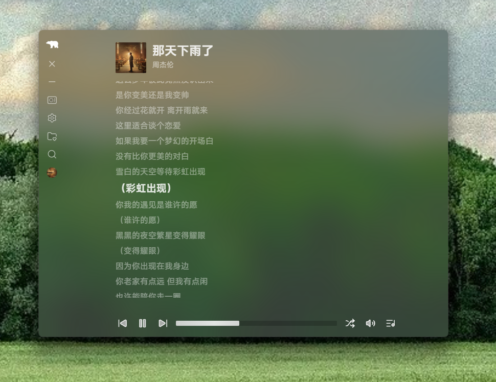
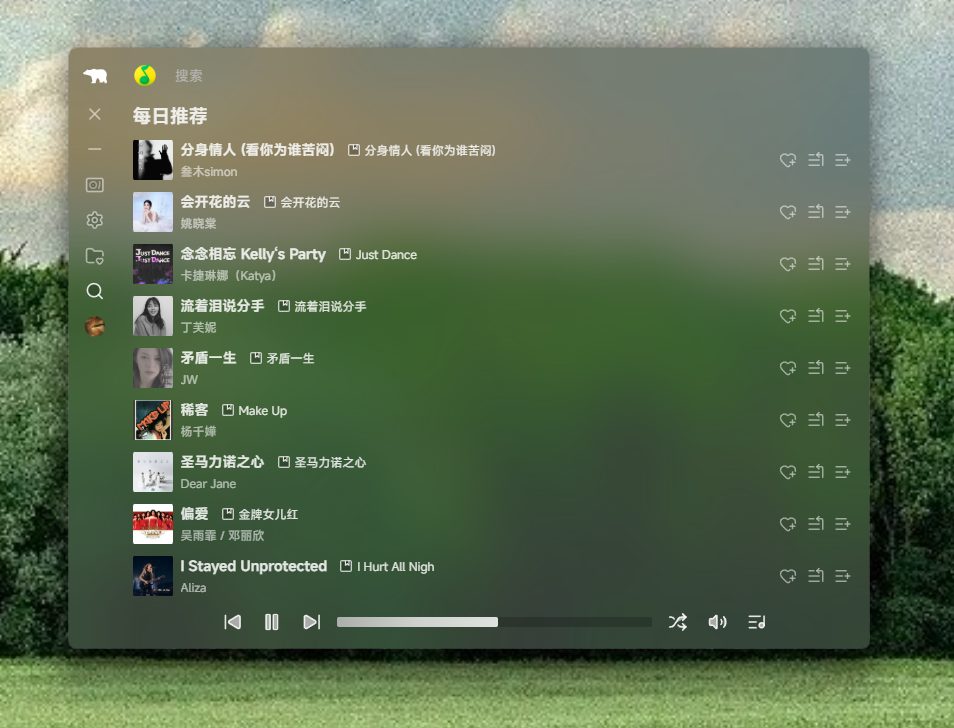

<h1 align="center">NETSIL</h1>

桌面音乐播放平台，聚合 **QQ 音乐** 与 **网易云音乐** 的搜索与播放能力，提供统一的播放队列与播放器体验。

---

## 📸 应用截图

### 🎧 网易云音乐搜索

  

### 🎵 QQ 音乐搜索

  

### ▶️ 播放页面

  

## 下载

- macOS：下载 [netsil-mac.dmg](https://github.com/mungaakei/netsil/releases/latest/download/netsil_0.1.2.dmg)
- Windows：下载 [netsil-win.msi](https://github.com/mungaakei/netsil/releases/latest/download/netsil_0.1.2.msi)

## 安全性

- MacOS：苹果菜单 → 系统设置 → 隐私与安全性 → 往下滚到“安全性”区域 → 点“仍要打开 / Open Anyway”
- Windows：直接安装即可
