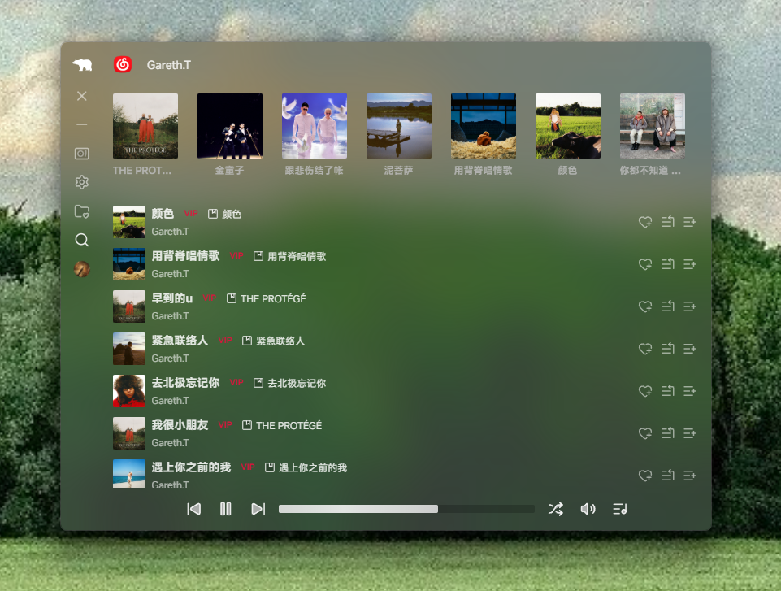
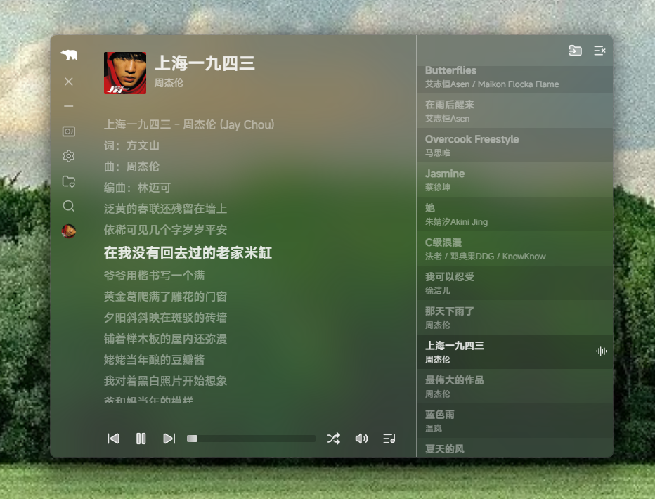

<h1 align="center">NETSIL</h1>

桌面音乐播放平台，支持 **MAC** 和 **Windows**，聚合 **QQ 音乐** 与 **网易云音乐** 的搜索与播放能力，提供统一的播放队列与播放器体验。

---

## 📸 应用截图

  

  

  

  

  

## 下载

- macOS：下载 [netsil-mac.dmg](https://github.com/mungaakei/netsil/releases/latest/download/netsil-mac.dmg)
- Windows：下载 [netsil-win.msi](https://github.com/mungaakei/netsil/releases/latest/download/netsil-win.msi)

## 安全性

- MacOS：苹果菜单 → 系统设置 → 隐私与安全性 → 往下滚到“安全性”区域 → 点“仍要打开 / Open Anyway”
- Windows：双击安装（信任运行即可）

遇到问题或建议欢迎 [提交 Issue](https://github.com/mungaakei/netsil/issues/new)
。
or 联系wechat：iannism81
